# Anakin AlphaZero Training Flow

This document explains exactly how AlphaZero training runs in the `anakin` system: the ordered steps, what each step does, and where every key function is implemented in this repository.

## Entry Point

- Main training entry: `src/jax_rl/systems/alphazero/anakin/system.py`
- Public function: `train(config: ExperimentConfig)`

`train(...)` is an orchestrator. It delegates initialization, rollout/update kernels, evaluation, logging, and checkpointing to specialized modules.

## Call Graph (High-Level)

```mermaid
flowchart TD
  A[train config] --> B[build_system]
  A --> C[make_alphazero_steps]
  A --> D[_run_warmup_rollouts]
  A --> E[jaxRL_Logger.from_config]
  A --> F[EvaluationManager]

  B --> B1[num_envs and buffer divisibility checks]
  B --> B2[init_policy_value_params]
  B --> B3[flashbax trajectory buffer init]
  B --> B4[checkpoint restore optional]
  B --> B5[replicate_tree train_state and buffer_state]
  B --> B6[pmap _init_runner_state]

  C --> C1[rollout_step pmap]
  C --> C2[update_step pmap]
  C1 --> C11[lax.scan over num_steps]
  C11 --> C12[root_fn and search_apply_fn]
  C11 --> C13[env.step]
  C11 --> C14[build ExItTransition]
  C1 --> C15[rollout_metrics search_finite on device]

  D --> D1[pmap_rollout warmup cycles]
  D --> D2[unreplicate_tree rollout_metrics]
  D --> D3[raise NumericalInstabilityError if non-finite search]

  G[for each update] --> H[act phase]
  H --> C1
  H --> H1[unreplicate_tree rollout_metrics only]
  H --> H2[deferred finite check]

  G --> I[train phase]
  I --> C2
  C2 --> I1[buffer_add]
  C2 --> I2[lax.scan learner_updates_per_cycle]
  I2 --> I3[buffer_sample]
  I3 --> I4[_loss_and_grads]
  I4 --> I5[compute_gae returns as target values]
  I2 --> I6[pmean grads and metrics]
  I2 --> I7[actor and critic optimizer updates]
  I --> I8[unreplicate_tree train_metrics]
  I --> I9[loss_is_finite and search_finite checks]

  G --> J[EvaluationManager.run_if_needed]
  G --> K[logger.log TRAIN and EVAL]
  G --> L[checkpoint save periodic]

  G --> M[next update]
  M --> G

  G --> N[finally close evaluation manager and logger]
  N --> O[return summary plus params]
```

## Function-to-File Map

| Training operation | Function / symbol | Source file |
|---|---|---|
| Train entrypoint | `train` | `src/jax_rl/systems/alphazero/anakin/system.py` |
| Warmup rollout loop | `_run_warmup_rollouts` | `src/jax_rl/systems/alphazero/anakin/system.py` |
| Build initialized system | `build_system` | `src/jax_rl/systems/alphazero/anakin/factory.py` |
| Action-space dimension inference | `_infer_action_dims` | `src/jax_rl/systems/alphazero/anakin/factory.py` |
| Dummy transition schema for buffer init | `_make_dummy_transition` | `src/jax_rl/systems/alphazero/anakin/factory.py` |
| PMAP step builders | `make_alphazero_steps` | `src/jax_rl/systems/alphazero/anakin/steps.py` |
| AZ rollout kernel | `rollout_step` | `src/jax_rl/systems/alphazero/anakin/steps.py` |
| AZ update kernel | `update_step` | `src/jax_rl/systems/alphazero/anakin/steps.py` |
| AZ loss and grads | `_loss_and_grads` | `src/jax_rl/systems/alphazero/anakin/steps.py` |
| Root function for MCTS | `make_root_fn` | `src/jax_rl/systems/alphazero/steps.py` |
| Recurrent function for MCTS | `make_recurrent_fn` | `src/jax_rl/systems/alphazero/steps.py` |
| Search method dispatch (`muzero` / `gumbel`) | `parse_search_method` | `src/jax_rl/systems/alphazero/steps.py` |
| Search invocation wrapper | `make_search_apply_fn` | `src/jax_rl/systems/alphazero/steps.py` |
| Search finite check | `search_output_is_finite` | `src/jax_rl/systems/alphazero/steps.py` |
| Rustpool embedding cleanup | `release_rustpool_embeddings` | `src/jax_rl/systems/alphazero/steps.py` |
| Shared GAE returns implementation | `compute_gae` | `src/jax_rl/systems/ppo/advantages.py` |
| Optimizer creation | `make_actor_optimizer`, `make_critic_optimizer` | `src/jax_rl/systems/ppo/update.py` |
| Evaluation runtime and scheduling | `Evaluator`, `EvaluationManager` | `src/jax_rl/systems/alphazero/eval.py` |
| Logging and LR extraction | `jaxRL_Logger`, `extract_learning_rate` | `src/jax_rl/utils/logging.py` |
| Timing helper | `PhaseTimer` | `src/jax_rl/utils/runtime.py` |
| Checkpoint save/restore | `Checkpointer.save`, `Checkpointer.restore` | `src/jax_rl/utils/checkpoint.py` |
| Replication helpers | `replicate_tree`, `unreplicate_tree`, `normalize_restored_train_state_and_key` | `src/jax_rl/utils/jax_utils.py` |
| Shared state types | `TrainState` | `src/jax_rl/utils/types.py` |
| AlphaZero transition container | `ExItTransition` | `src/jax_rl/systems/alphazero/search_types.py` |

---

## Step-by-Step Execution

### 0) Build initialized system state

Called from `train(...)`:

- `build_system(config, AlphaZeroRunnerState)` from `src/jax_rl/systems/alphazero/anakin/factory.py`

What `build_system(...)` does internally:

1. Validates setup
   - Confirms `system.name == "alphazero"`.
   - Validates MCTS memory budget via `_estimate_tree_memory_bytes(...)` against `tree_memory_budget_mb`.
   - Validates divisibility constraints for:
     - `num_envs`
     - `total_buffer_size`
     - `total_batch_size`
     against local device count.

2. Creates environment and infers spaces
   - Uses `make_stoa_env(...)` from `src/jax_rl/envs/env.py`.
   - Infers observation/action dimensions via:
     - `space_flat_dim(...)`
     - `space_feature_dim(...)`
     - `_infer_action_dims(...)`.

3. Initializes model and optimizers
   - Parameters via `init_policy_value_params(...)`.
   - Actor and critic optimizers via PPO optimizer builders:
     - `make_actor_optimizer(...)`
     - `make_critic_optimizer(...)`.
   - Wraps in `TrainState`.

4. Initializes checkpointer and optional restore
   - Creates `Checkpointer(...)`.
   - If `resume_from` is set:
     - Restores payload with `checkpointer.restore(...)`.
     - Normalizes restored train state and key through
       `normalize_restored_train_state_and_key(...)` to adapt sharding to current setup.

5. Initializes replay buffer
   - Imports `flashbax` and builds trajectory buffer (`make_trajectory_buffer`).
   - Creates an unbatched schema exemplar with `_make_dummy_transition(...)`.
   - Calls `buffer.init(dummy_transition)`.

6. Replicates and pmaps runner init
   - Replicates train state and buffer state via `replicate_tree(...)`.
   - Splits per-device keys and runs pmapped `_init_runner_state(...)`.

Factory output type:

- `AlphaZeroComponents` named tuple from `factory.py`.

---

### 1) Build pmapped training kernels

Called from `train(...)`:

- `make_alphazero_steps(...)` from `src/jax_rl/systems/alphazero/anakin/steps.py`

Returns:

- `pmap_rollout`: pmapped AlphaZero rollout step
- `pmap_update`: pmapped AlphaZero update step

Kernel construction:

- Search helpers are assembled from `src/jax_rl/systems/alphazero/steps.py`:
  - `make_root_fn(...)`
  - `make_recurrent_fn(...)`
  - `make_search_apply_fn(...)`
- Both step functions are wrapped with `jax.pmap(..., axis_name="device")`.

---

### 2) Warmup rollouts (optional)

Called before the main update loop:

- `_run_warmup_rollouts(config, pmap_rollout, runner_state)`

Warmup behavior:

- Computes required warmup rollout cycles from `warmup_steps` and `num_steps`.
- Executes `pmap_rollout` for each cycle.
- Unreplicates only the small `rollout_metrics` dict (not full trajectory payload).
- Raises `NumericalInstabilityError` if `search_finite` is false.

This keeps search validity checks while avoiding eager host transfer of the full rollout tree.

---

### 3) Per-update training loop

For each `update_idx` in `range(config.num_updates)`:

#### 3.1 Act (search rollout)

- Timed with `PhaseTimer`.
- Calls `pmap_rollout(runner_state)`.
- Returns `rollout_outputs = (traj, rollout_metrics)`.
- Host only unreplicates `rollout_metrics` and validates `search_finite`.

Inside `rollout_step(...)`:

- Runs `jax.lax.scan` for `system.num_steps`.
- For each env step:
  1. Splits RNG for root/search.
  2. Builds root embedding (`extract_root_embedding(...)`).
  3. Builds root (`root_fn(...)`) and search output (`search_apply_fn(...)`).
  4. Validates finite search values on device (`search_output_is_finite(...)`).
  5. Steps environment with selected action.
  6. Optionally releases Rustpool embeddings (`release_rustpool_embeddings(...)`).
  7. Builds `ExItTransition` with:
     - `obs`, `action`, `reward`, `done`
     - `search_value` from root node value
     - `search_policy` from action weights
     - per-step `info` including `search_finite`.

Rollout outputs:

- `traj`: batch-major trajectory (scan output transposed to `[batch, time, ...]`)
- `rollout_metrics`: tiny dict with aggregated `search_finite`.

#### 3.2 Train (buffer sample and optimization)

- Timed with `PhaseTimer`.
- Calls `pmap_update(runner_state, rollout_outputs)`.

Inside `update_step(...)`:

1. Adds rollout trajectory to replay buffer (`buffer_add_fn`).
2. Runs `jax.lax.scan` for `learner_updates_per_cycle`.
3. Each learner iteration:
   - Samples sequence batch (`buffer_sample_fn(...).experience`).
   - Computes grads and metrics through `_loss_and_grads(...)`.
   - Averages grads with `jax.lax.pmean` across devices.
   - Splits grads into actor/critic module subsets via `_zero_out_except_module(...)`.
   - Applies actor and critic Optax updates and merges updates into new param state.
4. Averages learner metrics and appends rollout `search_finite` into `train_metrics`.

Host-side after unreplication:

- Checks both:
  - `loss_is_finite`
  - `search_finite`
- Raises `NumericalInstabilityError` if either is false.
- Adds train `steps_per_second` and `learning_rate`.

#### 3.3 AlphaZero loss internals

`_loss_and_grads(...)` builds policy and value targets from sampled replay sequences.

- Policy target:
  - MCTS policy (`search_policy`) aligned with non-bootstrap timesteps.
- Value target:
  - Uses shared PPO `compute_gae(...)` for parity and DRY.
  - Uses only returned returns (index 1) as value targets.
  - Uses `truncated = zeros_like(done)` in AlphaZero sequence setting.
- Objective:
  - policy cross-entropy to search policy
  - value MSE to GAE returns
  - entropy regularization
- Emits metrics including `loss_is_finite`.

#### 3.4 Optional evaluation dispatch

- `EvaluationManager.run_if_needed(...)` from `src/jax_rl/systems/alphazero/eval.py`.
- Supports both policy-only and search-based action selection.
- Search-mode eval uses the same search primitives and finite checks.

#### 3.5 Logging and checkpointing

Logging in `system.py`:

- Logs training metrics each update (`LogEvent.TRAIN`).
- Logs evaluation metrics when available (`LogEvent.EVAL`).

Checkpointing in `system.py`:

- Saves per configured interval or final update.
- Unreplicates train state and key before save.
- Checkpoint metric:
  - max eval return if eval metrics exist,
  - otherwise negative training loss.

---

### 4) Shutdown and return

`train(...)` guarantees cleanup in `finally`:

- `evaluation_manager.close()`
- `logger.flush()`
- `logger.close()`

Return payload includes:

- `num_updates`, `start_update`, `ran_updates`
- latest merged `metrics`
- `checkpoint_path`
- `tensorboard_run_dir`
- final unreplicated model `params`

---

## Async and stability design notes

- Rollout and update kernels remain JAX-traced (`pmap`, `scan`, `vmap`) in hot path.
- Search finite validation is computed on device and surfaced as lightweight metrics.
- Host-side instability exceptions are deferred to metric boundaries (warmup / post-update), not eager trajectory reads.
- Replay-buffer and update loops avoid host synchronization between rollout and update primitives.

## Where each major responsibility lives

- Orchestration and warmup loop: `src/jax_rl/systems/alphazero/anakin/system.py`
- System construction and buffer init: `src/jax_rl/systems/alphazero/anakin/factory.py`
- PMAP rollout/update kernels: `src/jax_rl/systems/alphazero/anakin/steps.py`
- Search primitive builders and finite checks: `src/jax_rl/systems/alphazero/steps.py`
- Evaluation runtime/manager: `src/jax_rl/systems/alphazero/eval.py`
- Shared GAE implementation: `src/jax_rl/systems/ppo/advantages.py`
- Optimizer builders: `src/jax_rl/systems/ppo/update.py`
- Logging utilities: `src/jax_rl/utils/logging.py`
- Runtime timing helper: `src/jax_rl/utils/runtime.py`
- Checkpointing: `src/jax_rl/utils/checkpoint.py`
- Replication and restore normalization helpers: `src/jax_rl/utils/jax_utils.py`
- Shared data structures: `src/jax_rl/utils/types.py`
