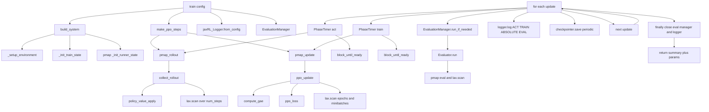

# Anakin PPO Training Flow

This document explains exactly how PPO training runs in the `anakin` system: the ordered steps, what each step does, and where every key function is implemented in this repository.

## Entry Point

- Main training entry: `src/jax_rl/systems/ppo/anakin/system.py`
- Public function: `train(config: ExperimentConfig)`

`train(...)` is an orchestrator. It delegates initialization, rollout/update kernels, evaluation, logging, and checkpointing to specialized modules.

## Call Graph (High-Level)

## Function-to-File Map

| Training operation | Function / symbol | Source file |
|---|---|---|
| Train entrypoint | `train` | `src/jax_rl/systems/ppo/anakin/system.py` |
| Build initialized system | `build_system` | `src/jax_rl/systems/ppo/anakin/factory.py` |
| Env/config divisibility checks | `_setup_environment` | `src/jax_rl/systems/ppo/anakin/factory.py` |
| Action-space dimension inference | `_infer_action_dims` | `src/jax_rl/systems/ppo/anakin/factory.py` |
| Model param init | `init_policy_value_params` | `src/jax_rl/networks/networks.py` |
| Optimizer creation | `make_actor_optimizer`, `make_critic_optimizer` | `src/jax_rl/systems/ppo/update.py` |
| Runner state init (pmapped) | `_init_runner_state` | `src/jax_rl/systems/ppo/anakin/factory.py` |
| Build pmapped step functions | `make_ppo_steps` | `src/jax_rl/systems/ppo/anakin/steps.py` |
| Rollout collection | `collect_rollout` | `src/jax_rl/systems/ppo/rollout.py` |
| Policy/value forward pass | `policy_value_apply` | `src/jax_rl/networks/networks.py` |
| PPO update core | `ppo_update` | `src/jax_rl/systems/ppo/update.py` |
| Advantage/return computation | `compute_gae` | `src/jax_rl/systems/ppo/advantages.py` |
| PPO objective | `ppo_loss` | `src/jax_rl/systems/ppo/losses.py` |
| Eval scheduling | `EvaluationManager.run_if_needed` | `src/jax_rl/systems/ppo/eval.py` |
| Stateful evaluator | `Evaluator.run` | `src/jax_rl/systems/ppo/eval.py` |
| Episode metric extraction | `extract_completed_episode_metrics` | `src/jax_rl/utils/logging.py` |
| Learning-rate extraction | `extract_learning_rate` | `src/jax_rl/utils/logging.py` |
| Phase timing and SPS | `PhaseTimer` | `src/jax_rl/utils/runtime.py` |
| Checkpoint save/restore | `Checkpointer.save`, `Checkpointer.restore` | `src/jax_rl/utils/checkpoint.py` |
| Shared training state types | `RunnerState`, `TrainState`, `SystemComponents` | `src/jax_rl/utils/types.py` |

---

## Step-by-Step Execution

### 0) Build initialized system state

Called from `train(...)`:

- `build_system(config)` from `src/jax_rl/systems/ppo/anakin/factory.py`

What `build_system(...)` does internally:

1. `_setup_environment(config)`
   - Validates divisibility constraints (`num_envs`, `minibatch_size`, `rollout_batch_size`).
   - Creates env + params with `make_stoa_env(...)` from `src/jax_rl/envs/env.py`.
   - Infers observation/action dimensions using:
     - `space_flat_dim(...)` from `src/jax_rl/utils/shapes.py`
     - `_infer_action_dims(...)` in factory module.

2. `_init_train_state(...)`
   - Creates PRNG keys via `jax.random.PRNGKey` / `jax.random.split`.
   - Builds actor/critic optimizers via:
     - `make_actor_optimizer(...)`
     - `make_critic_optimizer(...)`
     from `src/jax_rl/systems/ppo/update.py`.
   - Initializes model parameters via:
     - `init_policy_value_params(...)` from `src/jax_rl/networks`.
   - Creates `TrainState` from `src/jax_rl/utils/types.py`.
   - Instantiates `Checkpointer` from `src/jax_rl/utils/checkpoint.py`.
   - Optionally restores checkpoint state with `checkpointer.restore(...)`.
   - Replicates state across devices via `_replicate_tree(...)` in factory.

3. PMAP runner-state initialization
   - Creates device keys with `jax.random.split`.
   - `jax.pmap(...)` wraps `_init_runner_state(...)`.
   - `_init_runner_state(...)` resets env and returns `RunnerState`.

Factory output type:

- `SystemComponents` dataclass from `src/jax_rl/utils/types.py`

---

### 1) Build pmapped training kernels

Called from `train(...)`:

- `make_ppo_steps(...)` from `src/jax_rl/systems/ppo/anakin/steps.py`

Returns:

- `pmap_rollout`: pmapped rollout step
- `pmap_update`: pmapped update step

How kernels are built:

- `rollout_step(...)` calls `collect_rollout(...)` from `src/jax_rl/systems/ppo/rollout.py`.
- `update_step(...)` calls `ppo_update(...)` from `src/jax_rl/systems/ppo/update.py`.
- Both are wrapped with `jax.pmap(..., axis_name="device")`.

---

### 2) Initialize host-side services

In `train(...)`:

- Logger: `jaxRL_Logger.from_config(config)` from `src/jax_rl/utils/logging.py`
- Eval manager: `EvaluationManager(...)` from `src/jax_rl/systems/ppo/eval.py`
  - Uses `Evaluator` instances for each configured evaluation profile.

Early-return path:

- If `remaining_updates < 1`, training exits without rollout/update and returns current params.

---

### 3) Per-update training loop

For each global update index:

#### 3.1 Act (collect rollout)

- Timed by `PhaseTimer` from `src/jax_rl/utils/runtime.py`.
- Calls `pmap_rollout(runner_state)`.
- Immediately synchronizes host/device with:
  - `jax.block_until_ready(runner_state.obs)`

Inside rollout (`collect_rollout(...)` in `rollout.py`):

- Runs `jax.lax.scan` over `num_steps`.
- Each step:
  - Computes policy/value with `policy_value_apply(...)` from `src/jax_rl/networks`.
  - Samples action and log-prob from distribution.
  - Steps environment (`env.step`).
  - Extracts done/truncated/episode info.
  - Computes bootstrap value estimate.
- Produces:
  - `RolloutBatch`
  - `last_values`
  - next env state / obs / rng key
  - per-step episode info tensors

Host-side act metrics in `system.py`:

- `done_fraction` from rollout kernel output.
- `steps_per_second` using `PhaseTimer.steps_per_second(...)`.
- completed episode stats via `extract_completed_episode_metrics(...)` from `utils/logging.py`.

#### 3.2 Train (PPO update)

- Timed by `PhaseTimer`.
- Calls `pmap_update(runner_state, rollout_batch, last_values)`.
- Synchronizes with `jax.block_until_ready(runner_state.obs)`.

Inside update (`ppo_update(...)` in `update.py`):

1. Advantage/return computation:
   - `compute_gae(...)` from `src/jax_rl/systems/ppo/advantages.py`
2. Advantage normalization and NaN/Inf guards (`jnp.nan_to_num`).
3. Batch flattening (`_flatten_batch`).
4. Epoch loop with `jax.lax.scan`:
   - Shuffle indices with `jax.random.permutation`
   - Minibatch loop with `jax.lax.scan`
5. For each minibatch:
   - Compute PPO objective via `ppo_loss(...)` from `src/jax_rl/systems/ppo/losses.py`.
   - Get grads with `jax.value_and_grad(..., has_aux=True)`.
   - Cross-device average grads with `jax.lax.pmean(..., axis_name="device")`.
   - Split grads by module prefixes (`actor_`, `critic_`, `shared_`).
   - Apply updates through Optax optimizers.
6. Returns updated `TrainState`, metrics, and next RNG key.

Loss internals (`losses.py`):

- Actor: clipped ratio PPO objective + entropy regularization.
- Critic: clipped value regression.
- Combined `loss_total` with NaN/Inf guards.

Host-side train metrics in `system.py`:

- `steps_per_second` from `PhaseTimer`.
- `learning_rate` extracted from optimizer state via
  - `extract_learning_rate(...)` in `utils/logging.py`.

#### 3.3 Optional evaluation dispatch

- `EvaluationManager.run_if_needed(...)` from `src/jax_rl/systems/ppo/eval.py`
- Triggered per eval profile based on `eval_every`.
- Per evaluation:
  - Calls stateful `Evaluator.run(replicated_params, seed)`
  - Prefixes metrics by eval profile name
  - Adds eval SPS metric

Evaluator internals (`eval.py`):

- Builds eval env once in `Evaluator.__init__`.
- Uses pmapped evaluation function and `jax.lax.scan` over episode steps.
- Supports greedy or sampling policy behavior.
- Returns return stats + episode/step counts.

#### 3.4 Logging

From `system.py` using `jaxRL_Logger` (`utils/logging.py`):

- ACT event: rollout metrics
- TRAIN event: PPO update metrics
- ABSOLUTE event: timestep counter
- EVAL event: evaluation metrics (if any)

`logger.materialize(...)` flattens and prefixes metrics for final returned summary payload.

#### 3.5 Checkpointing

In `system.py`:

- Saves when:
  - `(global_update_idx + 1) % save_interval_steps == 0`, or
  - final local update.
- Unreplicates train state + key on host.
- Chooses checkpoint metric as max `*/return_mean` across active eval profiles, else `-inf`.
- Persists via `checkpointer.save(...)` from `utils/checkpoint.py`.

---

### 4) Shutdown and return

`train(...)` guarantees cleanup in `finally`:

- `evaluation_manager.close()`
- `logger.flush()`
- `logger.close()`

Return payload includes:

- `num_updates`, `start_update`, `ran_updates`
- merged `metrics`
- `checkpoint_path`
- `tensorboard_run_dir`
- final unreplicated model `params`

---

## Where each major responsibility lives

- Orchestration loop: `src/jax_rl/systems/ppo/anakin/system.py`
- System construction: `src/jax_rl/systems/ppo/anakin/factory.py`
- PMAP step builders: `src/jax_rl/systems/ppo/anakin/steps.py`
- Rollout collection: `src/jax_rl/systems/ppo/rollout.py`
- PPO update/optimizers: `src/jax_rl/systems/ppo/update.py`
- GAE: `src/jax_rl/systems/ppo/advantages.py`
- PPO losses: `src/jax_rl/systems/ppo/losses.py`
- Evaluation runtime/manager: `src/jax_rl/systems/ppo/eval.py`
- Logging and metric helpers: `src/jax_rl/utils/logging.py`
- Timing helper: `src/jax_rl/utils/runtime.py`
- Checkpointing: `src/jax_rl/utils/checkpoint.py`
- Shared datatypes (`RunnerState`, `TrainState`, `SystemComponents`): `src/jax_rl/utils/types.py`
