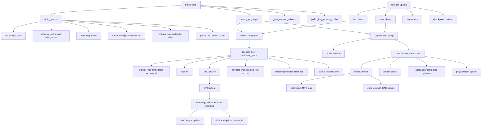

# Anakin SPO Training Flow

This document explains how SPO training runs in the `anakin` system, where each major operation lives, and the key implementation constraints for stateful Rustpool environments (such as `rlpallet:UldEnv-v2`).

## Entry Point

- Main training entry: `src/jax_rl/systems/spo/anakin/system.py`
- Public function: `train(config: ExperimentConfig)`

`train(...)` orchestrates initialization, rollout/search, replay sampling, MPO updates, logging, and checkpointing.

## Call Graph (High-Level)



## Function-to-File Map

| Training operation | Function / symbol | Source file |
|---|---|---|
| SPO train entrypoint | `train` | `src/jax_rl/systems/spo/anakin/system.py` |
| Warmup rollouts | `_run_warmup_rollouts` | `src/jax_rl/systems/spo/anakin/system.py` |
| Build initialized system | `build_system` | `src/jax_rl/systems/spo/anakin/factory.py` |
| Dummy transition schema | `_make_dummy_transition` | `src/jax_rl/systems/spo/anakin/factory.py` |
| PMAP step builders | `make_spo_steps` | `src/jax_rl/systems/spo/anakin/steps.py` |
| SPO rollout kernel | `rollout_step` | `src/jax_rl/systems/spo/anakin/steps.py` |
| SPO update kernel | `update_step` | `src/jax_rl/systems/spo/anakin/steps.py` |
| Actor+dual MPO objective | `_actor_dual_loss` | `src/jax_rl/systems/spo/anakin/steps.py` |
| Critic objective (GAE returns) | `_critic_loss` | `src/jax_rl/systems/spo/anakin/steps.py` |
| SPO root function | `make_root_fn` | `src/jax_rl/systems/spo/steps.py` |
| SPO recurrent function | `make_recurrent_fn` | `src/jax_rl/systems/spo/steps.py` |
| SMC search | `class SPO` | `src/jax_rl/systems/spo/steps.py` |
| MPO losses | `categorical_mpo_loss`, `multidiscrete_mpo_loss` | `src/jax_rl/systems/spo/losses.py` |
| Root embedding extraction for rustpool | `extract_root_embedding` | `src/jax_rl/systems/alphazero/steps.py` |
| Shared GAE implementation | `compute_gae` | `src/jax_rl/systems/ppo/advantages.py` |

---

## Step-by-Step Execution

### 0) Build initialized system state

`build_system(config, SPORunnerState)`:

1. Validates divisibility constraints for pmap compatibility.
2. Creates env via `make_stoa_env(...)`.
3. Infers observation/action dimensions and initializes:
   - `actor_online`, `critic_online`
   - `actor_target`, `critic_target` (initially copies)
   - dual params (`log_temperature`, `log_alpha`)
4. Builds optimizers:
   - actor optimizer
   - critic optimizer
   - dual optimizer (`adam` on dual variables)
5. Initializes Flashbax trajectory buffer with `SPOTransition` schema.
6. Replicates state and initializes per-device runner state with `jax.pmap`.

### 1) Build pmapped kernels

`make_spo_steps(...)` returns:

- `pmap_rollout`
- `pmap_update`

Both are `jax.pmap(..., axis_name="device")`.

### 2) Rollout / Search (act phase)

For each env step in `jax.lax.scan`:

1. Extract root embedding:
   - Rustpool path uses `extract_root_embedding(...)` (snapshot-backed state IDs).
2. Build root with `make_root_fn(config)`:
   - policy logits and critic value from target networks,
   - Dirichlet noise,
   - post-noise action mask application,
   - invalid logits clamped to `-1e9`.
3. Run `SPO.search(...)`:
   - `rollout(...)` across `search_depth`,
   - recurrent stepping, SMC td-weight updates, ESS/resampling,
   - root action chosen from weighted particles.
4. Step real environment using selected root action.
5. Release generated Rustpool state IDs from search rollouts.
6. Store `SPOTransition` into trajectory output.

### 3) Update (train phase)

For each learner update:

1. Sample trajectory batch from Flashbax.
2. Actor+dual update with MPO loss.
3. Critic update with GAE-based returns (trajectory target, not root search value).
4. Apply gradients (with cross-device `pmean`).
5. Polyak update target networks using `target_tau`.
6. Report metrics including:
   - `search_finite`
   - `invalid_action_rate`
   - `released_state_ids`

### 4) Logging and checkpointing

`system.py`:

- Runs warmup rollouts if configured.
- Checks finite search and finite loss.
- Logs train metrics every update.
- Saves checkpoints on configured intervals.

---

## Action Masking and Stateful Rustpool: Critical Notes

SPO must obey two constraints simultaneously:

1. **Mask correctness**: invalid actions must never be sampled at root for executed env actions.
2. **State lifecycle correctness**: search-generated Rustpool states are real host resources and must be managed safely.

### What went wrong (hard bug)

This was difficult because symptoms looked like pure masking failures (`Invalid EMS`, `Placement Failed`, `Empty or invalid group`) while multiple issues interacted:

1. **Wrong root embedding source in diagnostics**
   - Using synthetic IDs (`arange`) instead of snapshot-backed state IDs causes invalid state trajectories in stateful pools.
2. **Unsafe release filtering**
   - Releasing IDs with `>= 0` can attempt to release invalid/sentinel IDs.
3. **Terminal particle stepping in search**
   - Recurrent search continued to step particles already marked terminal, which can generate invalid recurrent transitions in stateful env pools.

### How it was solved

1. **Snapshot-backed root IDs**
   - Root embedding uses `extract_root_embedding(...)` for Rustpool statefulness.
2. **Strict release filter**
   - Release only `state_id > 0`; map everything else to sentinel `-1`.
3. **Terminal guard in `SPO.one_step_rollout(...)`**
   - Do not advance dead particles with their own stale invalid pairs.
   - Sanitize recurrent inputs for terminal particles.
   - Preserve terminal particle state/values and zero out recurrent contributions.
4. **Mask hardening at root**
   - After Dirichlet mixing and renormalization, invalid logits are forced to `-1e9`.

---

## Rustpool-specific Operational Guidance

- Treat Rustpool/rlpallet as **stateful pools**, not pure functions.
- Always use snapshot-derived state IDs for search root.
- Always release search-generated state IDs after each rollout step.
- Never release non-positive IDs.
- Do not step already-terminal particles as if they were alive.

---

## Useful Configs

- `config/binpack/spo.yaml`
- `config/jaxpallet/spo.yaml`
- `config/uldenv/spo.yaml`

Example:

```bash
uv run jax-rl-train --config-name uldenv/spo
```

Short smoke:

```bash
uv run jax-rl-train --config-name uldenv/spo arch.total_timesteps=64 arch.num_envs=2 arch.num_steps=1 system.num_particles=2 system.search_depth=2
```

---

## Tests for SPO Stability / Masking

Primary SPO tests:

- `tests/test_spo.py`

Especially relevant:

- root masking legality tests (invalid probability/rate checks),
- minimal ULD search tests checking for error prints and mask-valid actions,
- Rustpool recurrent shape and memory release tests.

Run all SPO tests:

```bash
uv run pytest tests/test_spo.py -q
```

Run targeted masking/stateful tests:

```bash
uv run pytest tests/test_spo.py -k "minimal_uld_search_no_error_prints or minimal_uld_search_actions_follow_mask or invalid_action" -q
```

---

## Reference

- Historical SPO reference used for parity checks: `SPO_JAX.txt`.
- Important adaptation in this repo: stateful Rustpool handling and release lifecycle must be explicit in SPO search integration.